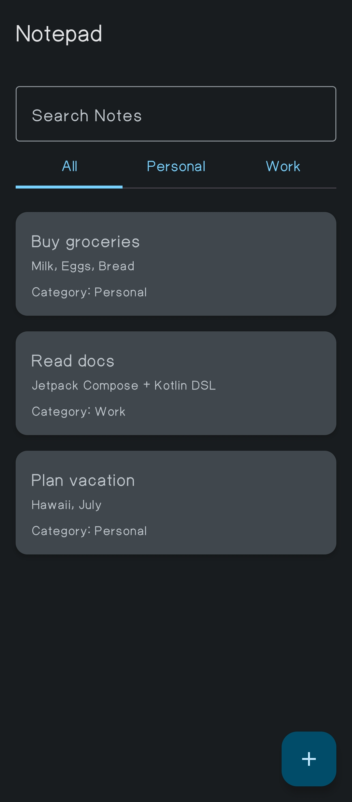
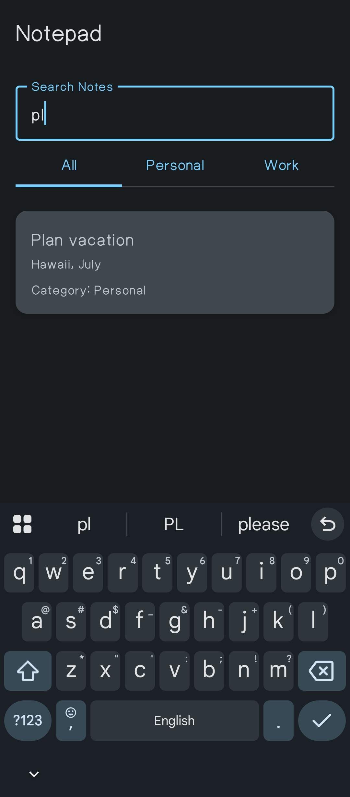
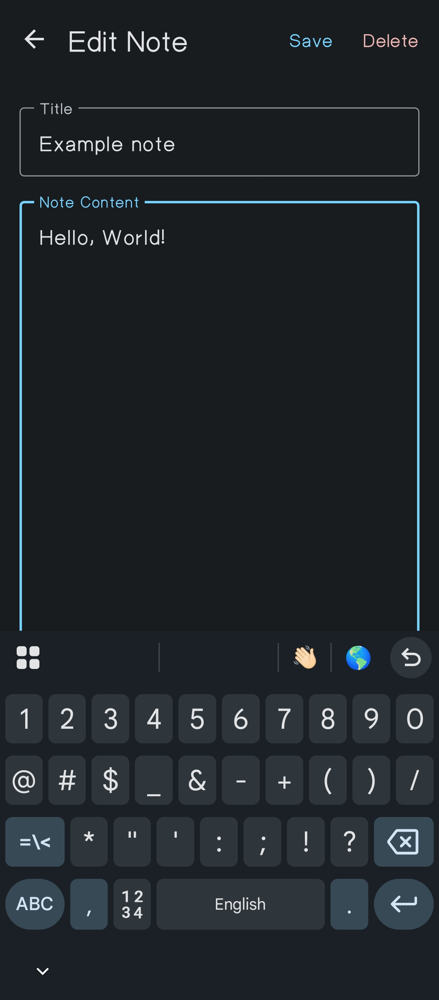
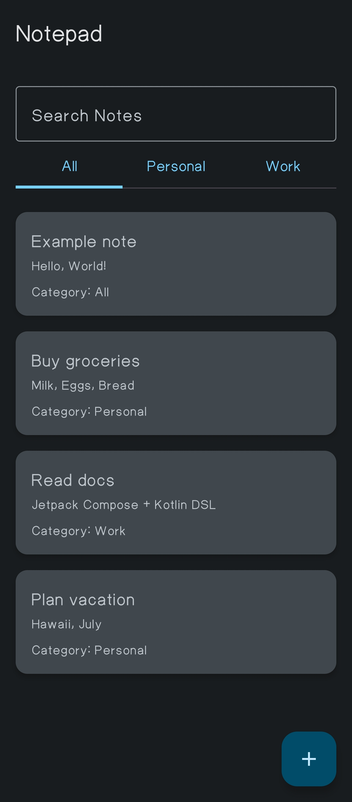

# Notepad App

A simple note-taking app built with Jetpack Compose and Kotlin. The app allows users to create, edit, and delete notes. Notes can be categorized into different categories like Personal and Work. It also provides search functionality to find notes quickly.

## Features
- Create, edit, and delete notes
- Categorize notes into "Personal" and "Work" categories
- Search notes by title and content
- View and navigate through a list of notes
- Save changes to notes

## Architecture
This app uses Jetpack Compose for the UI and follows modern Android app architecture principles. It demonstrates the use of state management with `remember` and `mutableStateListOf` to handle dynamic data. 

## Screenshots






## Requirements
- Android Studio 4.2+ 
- Kotlin 1.5+
- Jetpack Compose 1.0+

## Installation

1. Clone the repository:

   ```bash
   git clone https://github.com/Nemirus/Notepad.git
   ```

2. Open the project in Android Studio.

3. Build and run the app on an emulator or a physical device.

## Usage
Once the app is launched, you will be able to:
- **Add a new note** using the floating action button.
- **Edit a note** by clicking on any existing note from the list.
- **Search for notes** by typing in the search bar.
- **Categorize notes** by selecting a category in the tabs at the top.

## Code Structure
- `MainActivity.kt`: The main entry point of the app that initializes and displays the app's UI.

## Contributing
Feel free to fork this repository, make changes, and submit a pull request. Please make sure to follow the project's coding style and add relevant tests.

## License
This project is licensed under the MIT License - see the [LICENSE](LICENSE) file for details.